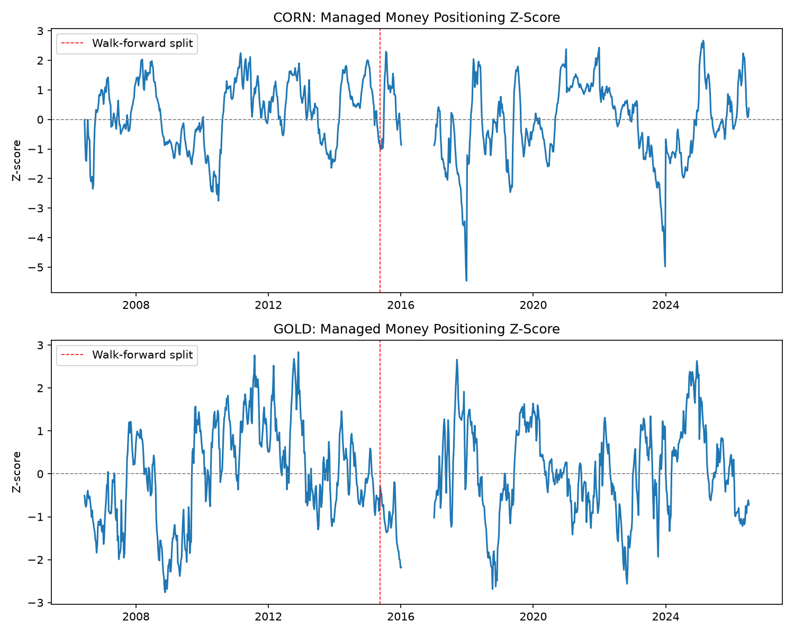
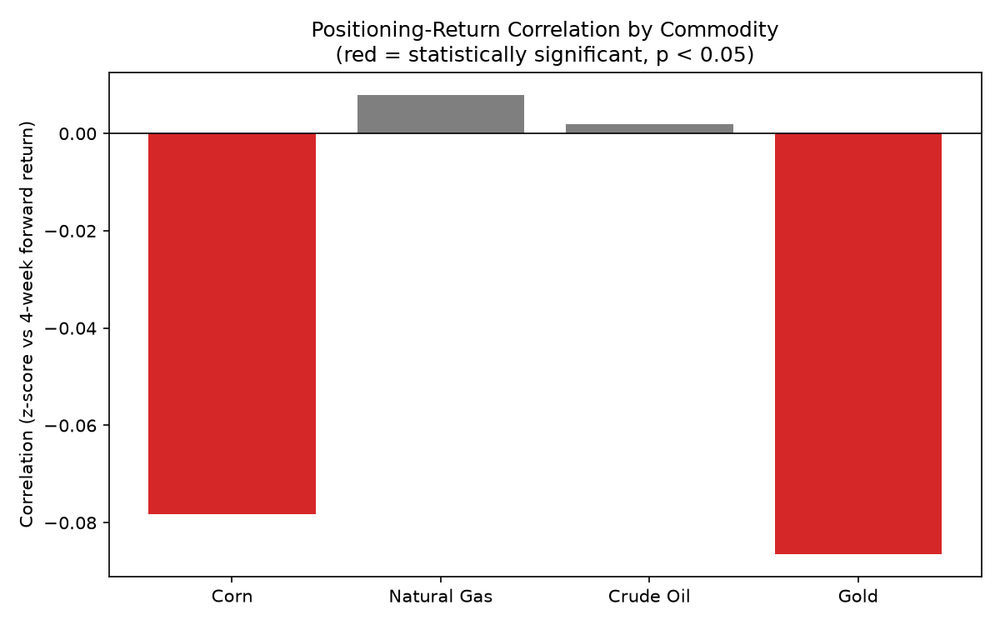

# Commodity Positioning Signals

I wanted to test something that gets talked about a lot in commodity 
markets but rarely tested properly: does it actually matter when hedge 
funds get crowded into one side of a trade? The CFTC publishes exactly 
this data every week, for free, going back to 2006.

I picked four commodities across different sectors, WTI Crude, Natural 
Gas, Gold, and Corn, and tested whether extreme positioning in the 
"Managed Money" category predicted returns over the following 1 and 4 
weeks.

**Short version: there's a small mean-reverting effect in Corn
at the 4-week horizon, but it only holds up in the first half of the 
sample. I don't think it's a real, tradeable signal.**

Natural Gas,Gold and Crude showed nothing at either horizon. When I split the 
data in half to check if the Corn effect was stable over time, it 
shows up clearly from 2006 through mid-2015 and disappears completely 
after that, so it looks more like a residue of one unusual period 
(probably the 2008-2009 crisis) than a persistent pattern.

## Data

Positioning data comes from the CFTC's Disaggregated Commitments of 
Traders report (futures-only), pulled with the `cot_reports` Python 
library rather than parsing the raw CFTC text files directly, since 
those files don't include column headers and I didn't want to risk 
misassigning 190 columns by hand.

Price data comes from Yahoo Finance (`CL=F`, `NG=F`, `GC=F`, `ZC=F`), 
daily closes, same 2006-2026 window.

## Method

For each commodity, each week, I calculated net Managed Money positioning as:

    net_managed_money = M_Money_Positions_Long - M_Money_Positions_Short

Then I converted that into a z-score using a rolling 104-week window (2 
years):

    z = (net_managed_money - rolling_mean) / rolling_std

I required at least 52 weeks of history before calculating anything, so 
early rows aren't compared against too little data.

Forward returns are calculated in trading days, not calendar days (5 days 
≈ 1 week, 20 days ≈ 4 weeks), since futures markets are closed weekends. 
I shifted the return calculation backward so each week's z-score lines up 
with what actually happened afterward, not what already happened before 
it, since using future information to explain the present would 
invalidate the whole test.

## Results

### Correlation between positioning z-score and forward returns

| Commodity | 1-week corr | 1-week p-value | 4-week corr | 4-week p-value |
|---|---|---|---|---|
| Corn | -0.041 | 0.198 | -0.078 | 0.014 |
| Natural Gas | 0.001 | 0.977 | 0.008 | 0.827 |
| Crude Oil | 0.011 | 0.762 | 0.002 | 0.957 |
| Gold | -0.043 | 0.177 | -0.086 | 0.007 |

Nothing shows up at 1 week for any commodity. At 4 weeks, Corn 
clears the standard p < 0.05 threshold. Natural Gas, Gold and Crude don't 
come close at either horizon.

### Walk-forward split (Corn and Gold, 4-week horizon)

Split date: May 19, 2015 (the median date across the full sample).

| Commodity | Period | Correlation | p-value |
|---|---|---|---|
| Corn | 2006 to May 2015 | -0.137 | 0.003 |
| Corn | May 2015 to 2026 | -0.036 | 0.415 |
| Gold | 2006 to May 2015 | -0.160 | 0.0005 |
| Gold | May 2015 to 2026 | 0.003 | 0.941 |

This is the part that changed my mind about the result. Splitting the 
sample in half shows the whole effect is concentrated in the first half. 
After May 2015, correlations sit near zero and the p-values aren't close 
to significant.



You can see the walk-forward split marked on the chart. The positioning 
swings look similarly wild on both sides of the line, which is part of 
why I don't think this is really about positioning becoming calmer, it's 
that the relationship between positioning and what happens next stopped 
holding.



## Limitations

The effect sizes are small even where significant. A correlation of 
-0.08 explains well under 1% of the variation in returns, and I doubt it 
would survive real trading costs even if it were stable over time, which 
it isn't.

COT data is released with a lag (Friday, covering the prior Tuesday), so 
any real-world use of this would need to account for that delay rather 
than assuming same-day knowledge of positioning.

Four commodities and one report type is a narrow slice of the market. 
I'd want to test this across more commodities, and against the 
Producer/Merchant category as well, before drawing any firm conclusion 
either way.

## Running this

```
pip install -r requirements.txt
python3 main.py
python3 get_prices.py
python3 build_signal.py
python3 test_signal.py
python3 make_charts.py
```

Each script reads from and writes to the `data/` folder, so they need to 
run in this order the first time. After that, most of them can be rerun 
independently since the intermediate CSVs are already saved.
